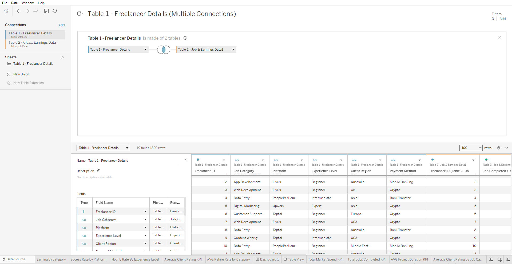
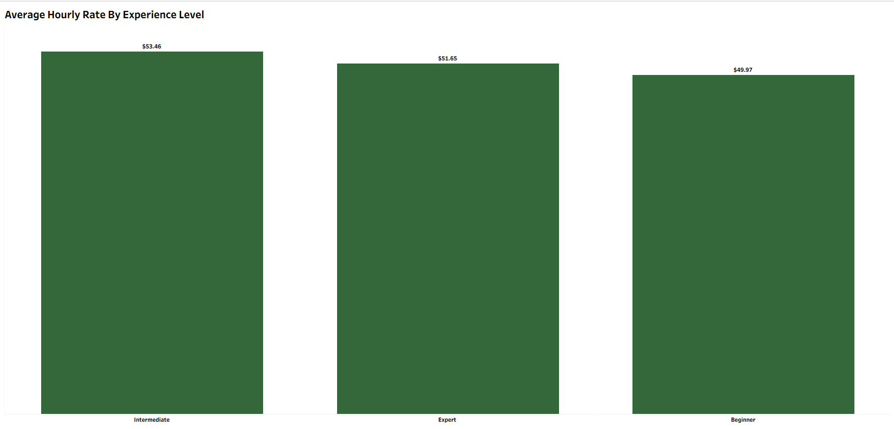
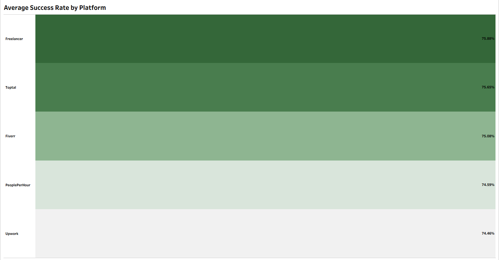
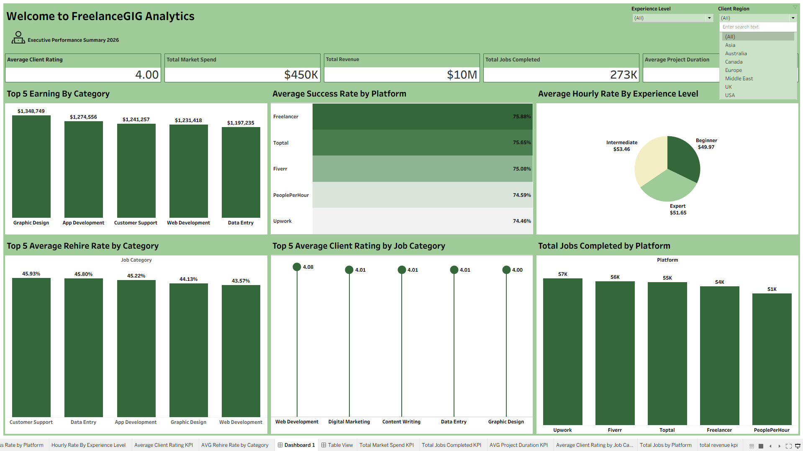

# FreelanceGIG Ecosystem Analysis

## Leveraging Tableau to evaluate operational performance, talent pricing dynamics, and market scalability across a global freelance platform.

Disclaimer ⚠️: All datasets, reports, and visualisations do not contain real proprietary, confidential, or sensitive information from any company, institution, or individual. All data represents dummy/mock transactional logs designed to demonstrate my capabilities in using Tableau Desktop to build advanced business intelligence analytics for the freelance and gig economy sector.

## INTRODUCTION 

This project leverages data analytics and transactional history to evaluate operational health and profitability drivers for FreelanceGIG. By analyzing a global dataset encompassing 273,000 completed jobs, I built an interactive analytical suite to map out how a $450,000 marketing investment successfully converted into $10,000,000 in total platform revenue while maintaining an overall 4.00/5.00 client satisfaction rating.

Through Tableau Desktop, this project transforms complex transactional data into actionable strategic insights, identifying the exact talent tiers, service categories, and marketplace platforms that drive user retention and revenue scaling.

## PROBLEM STATEMENT

The global freelance marketplace is highly dynamic and sensitive to fluctuating talent rates, varying service quality, and platform-specific conversion success. Traditional high-level reporting often fails to capture the subtle trade-offs between volume, price, and client satisfaction.

The core challenge lies in pinpointing:

- Which service categories drive raw revenue versus those that deliver peak quality.
- How talent experience levels directly impact market pricing and client demand.
- Which hosting platforms yield the highest completion reliability and user retention.

## AIM OF THE PROJECT

The primary objectives of this analytical audit are to:

- Analyze transactional performance logs to uncover underlying revenue patterns and client satisfaction trends.
- Develop an interactive executive dashboard in Tableau with dynamic filtering capabilities for Region and Experience Level.
- Evaluate the relationship between hourly rates, freelancer experience tiers, and market demand.
- Assess platform reliability across key competitors including Upwork, Fiverr, Toptal, Freelancer, and PeoplePerHour.
- Provide data-driven strategic recommendations to optimize platform marketing spend and client retention.

## SKILLS & CONCEPTS DEMONSTRATED

- Business Intelligence: Executive-level KPI tracking, ROI evaluation, and market performance benchmarking.
- Data Architecture & Preparation: Primary key joins, field standardization, and missing value filtering.
- Advanced Tableau Development: Custom dual-axis donut charts, lollipop visualisations, targeted Top-5 bar charts, and container-based dashboard formatting.
- Strategic Communication: Translating complex transactional metrics into clear executive briefings.

## MODELLING & DATA PREPARATION
I conducted data cleaning and preparation in Tableau Desktop to ensure data integrity across the analysis:

- Data Integration: Executed a primary join between Table 1 (Freelancer Details) and Table 2 (Job & Earnings Data) using Freelancer ID as the common key.
- Data Hygiene: Applied global filter functions to exclude null value records and standardized text attributes for consistent naming across platforms and job categories.
- Data Formatting: Ensured appropriate data type formatting (Date, Text, Currency ($), Percentage (%)) for accurate aggregation.
- Calculated Fields: Engineered custom measures for Market ROI, Average Client Ratings, and Rehire Percentages to establish meaningful analytical baselines.

## VISUALIZATION BREAKDOWN
The analytical suite incorporates the following visual structures:

- Executive KPIs: Top-level BANs (Big Angry Numbers) tracking Total Revenue, Market Spend, Total Jobs, Client Rating, and Average Project Duration.
- Top-5 Bar Charts: Highlighting top-performing categories by revenue generation and rehire potential.
- Custom Lollipop Chart: Tracking quality benchmarks across job categories with high visual precision.
- Dual-Axis Donut Chart: Mapping hourly rate distribution across freelancer experience tiers.
- Horizontal Performance Bars: Visualising average success rates and job volume across competing platforms.

## DATA ANALYSIS
### KPI Benchmarks

The top-level Key Performance Indicators provide an immediate health check of the platform:

- Total Revenue Generated: $10,000,000
- Total Market Spend: $450,000 (reflecting a 22.2x return on investment)
- Total Jobs Completed: 273,000
- Average Client Rating: 4.00 / 5.00
- Average Project Duration: 44 Days

### Category Performance & Quality Analysis
### Revenue Leaders (Top 5 Earning by Category)
My analysis identifies Graphic Design as the primary financial driver of the ecosystem, generating $1,348,749 in revenue. Technical and operational support roles follow closely behind, led by App Development ($1,274,556), Customer Support ($1,241,257), Web Development ($1,231,418), and Data Entry ($1,197,235).

### Quality Benchmarks (Top 5 Average Client Rating)
Using a lollipop visualization to evaluate client satisfaction, Web Development emerged as the quality benchmark with an average rating of 4.08 / 5.00. The remaining top categories, Digital Marketing, Content Writing, and Data Entry hold a consistent 4.01 rating, proving tight quality standardization across diverse service lines.

### Talent Pricing & Platform Dynamics
### Hourly Rate by Experience Level (Bar Chart)
By analyzing compensation across experience tiers, I discovered an interesting market trend:
- Intermediate Freelancers command the highest market average at $53.46 / hr.
- Experts follow closely at $51.65 / hr.
- Beginners maintain a competitive baseline at $49.97 / hr.
This indicates that buyers place a strong premium on mid-tier agility and cost efficiency over traditional seniority.

### Platform Reliability & Volume
- Average Success Rate: Freelancer leads the ecosystem in transaction reliability with a 75.88% success rate, followed by Toptal (75.65%) and Fiverr (75.08%).
- Total Volume: Upwork (57,000 jobs) and Fiverr (56,000 jobs) represent the highest transaction channels on the platform.
- Customer Retention: Customer Support acts as the primary retention anchor, leading all categories with a 45.93% rehire rate.

## Dashboard Preview

## RECOMMENDATIONS
Based on the insights derived from this analysis, I propose the following strategic roadmap:

- Focus Marketing on Intermediate Talent: Because Intermediate freelancers command the highest hourly rates ($53.46/hr), promotional campaigns should target this demographic to maximize commission revenue.
- Promote Web Development Quality: Leverage the 4.08 client rating in Web Development as a primary case study in marketing assets to showcase service excellence.
- Incentivise Customer Support Retention: Build tailored loyalty and subscription options for Customer Support clients to capitalise on the category's high 45.93% rehire rate.
- Optimize High-Volume Channels: Maintain infrastructure investment on high-volume partners (Upwork and Fiverr) while adopting operational best practices from Freelancer to lift global completion rates.

-------

Dashboard Link : https://public.tableau.com/views/FreelanceGIGDashboard/Dashboard1?:language=en-US&:sid=&:redirect=auth&:display_count=n&:origin=viz_share_link

